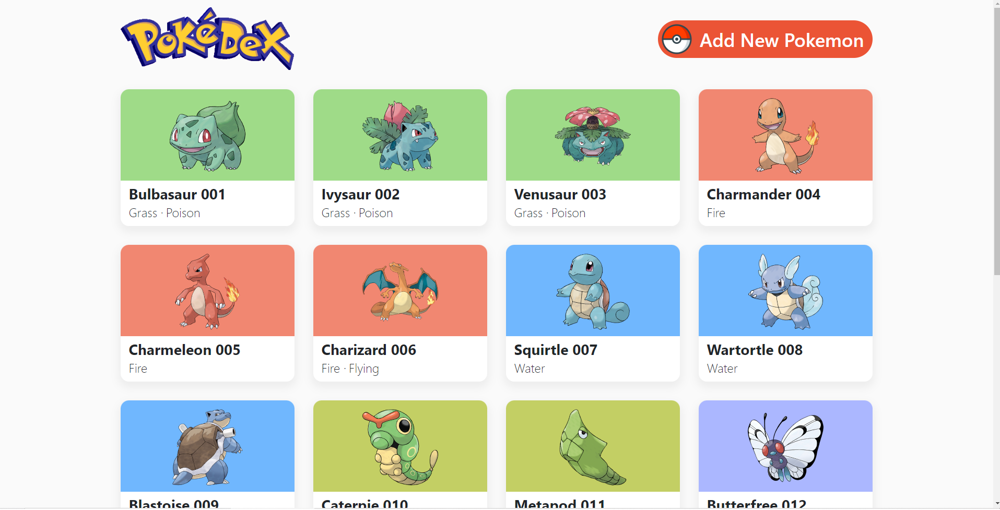

# Pokedex

A Fullstack CRU Pokemon App built with React and Ruby on Rails.

## Table of Contents
* [General Info](#general-information)
* [Built With](#technologies-used)
* [Features](#features)
* [Screenshots](#screenshots)
* [Setup](#setup)
* [Usage](#usage)
* [Room for Improvement](#room-for-improvement)

## General Info
For simplicity, both the backend and front end will be contained in the same GitHub. If this were a larger project I would most definitely separate the Front and Backend.\
\
[Here is a link](DESIGN_DOC) to the design doc that helped guide me through the project.


## Built With
Project is created with:
* Ruby version: 12.3
* Rails version: 3.1.2
* React version: 18.2.0

Gems:
* rack-cors
* pagy

React Libraries:
* axios
* react-dom
* react-paginate
* react-select
* mui/material

## Features
* Add Pokemon
* Update Pokemon
* Pagination
* Responsive Front End

## Screenshot


## Setup
To clone and run this application, you'll need [Git](https://git-scm.com), [Ruby on Rails](https://www.tutorialspoint.com/ruby-on-rails/rails-installation.htm), and [Node.js](https://nodejs.org/en/download/) (which comes with [npm](http://npmjs.com)) installed on your computer.
```
# Clone this repository
$ git clone https://github.com/Nhendy12/pokedex.git

# Go into the repository
$ cd pokedex
```

## Usage

```bash
#for Backend

# to install all req'd dependencies
$ bundle install
# to make all database migrations
$ rake db:migrate
# generate initial seed data
$ rails db:seed
# start the local server (http://localhost:3000)
$ rails s

# for Frontend

# cd into frontend directory
$ cd pokedex-frontend
# Install dependencies
$ npm install
# Run the app
$ npm start
```

## Final Thoughts/Room for Improvement
I really enjoyed working on this project and I loved the pokemon aspect that added that personal touch!\
It definitely helped me brush up on my React skills and I think in the future I will be adding more to this project!

Items I missed/would have done with more time:
* Better form validation
* Getting the forms to closer match the designs
* Fixing inheritances, right now when you create or update a pokemon it just refreshes the page. I would have liked it to instead just rerender the list of pokemon
* Add tests
* Loading States
* Empty States
* demo
* API docs